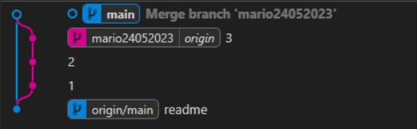

5.1 ➡ Creamos el repositorio local "repo05" y lo conectamos con el repositorio remoto que hemos creado.

5.2 ➡ Creamos el archivo "readme.md".

5.3 ➡ Creamos la rama "mario24052023" y nos movemos a ella.

5.4 ➡ Hacemos 3 commits en la rama "mario24052023" (en la imagen podemos visualizar el log de los 3 commits).

5.6 ➡ Hacemos el merge no fastforward y lo visualizamos con el comando adog y en la extensió

5.7 ➡ Visualizamos las ramas con el comando "git log --all --decorate --oneline --graph" y en la extensión.

5.8 ➡ El merge no fast forward conecta el final de la rama en un solo punto de otra rama, el fast forward fusiona ambas ramas.

